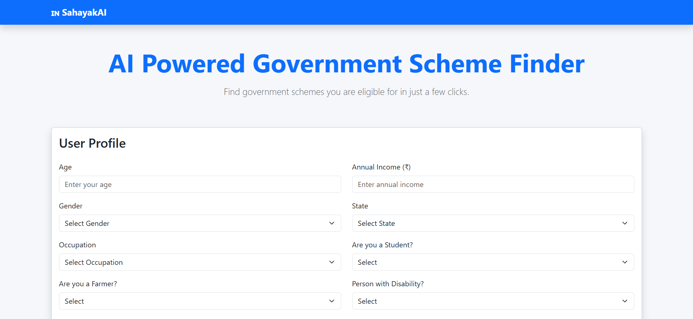
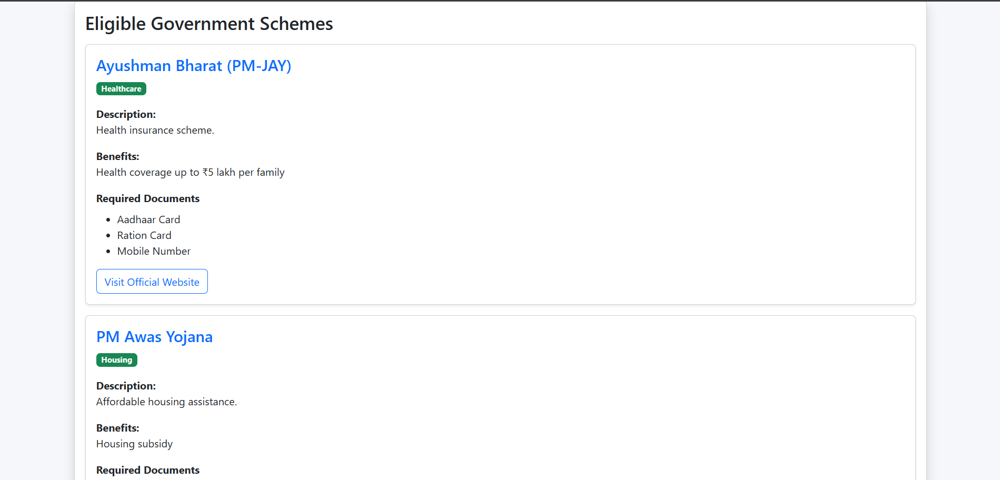
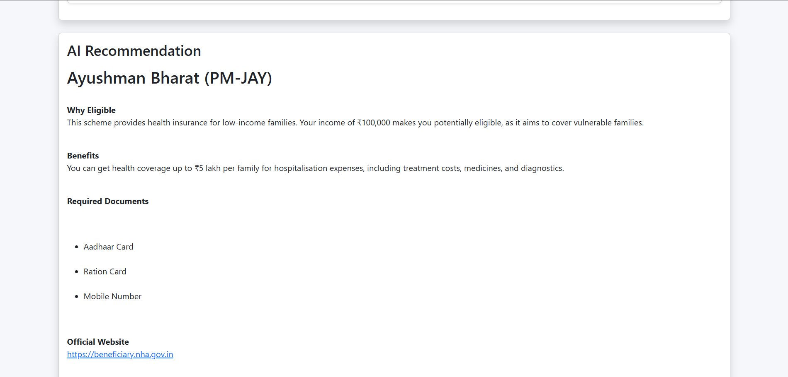
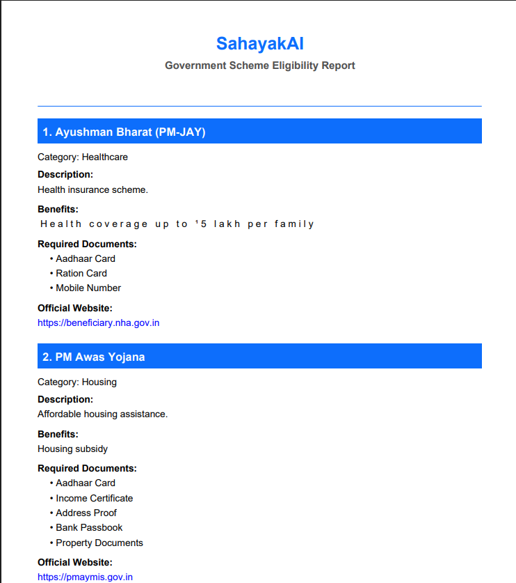

# 🇮🇳 SahayakAI

SahayakAI is an AI-powered Government Scheme Finder that helps users discover government schemes they are eligible for based on their profile. The application matches user information with predefined eligibility rules and provides AI-generated explanations to help users understand the schemes.

---

## 🌐 Live Demo

**Deployed Application:** https://sahayak-ai-swho.onrender.com

---

## 🤖 How AI Works

1. The user enters personal details such as age, income, occupation, state, and other eligibility information.
2. The backend validates the user input.
3. SQLite filters government schemes using predefined eligibility rules to identify all eligible schemes.
4. The eligible schemes are sent to **Google Gemini AI**.
5. Gemini AI generates personalized explanations, including scheme benefits, eligibility reasons, required documents, and official application links.
6. Users can download the personalized recommendations as a **PDF report** for future reference.

---

## ✨ Features

- Check eligibility for government schemes
- AI-powered recommendations using Google Gemini
- Responsive Bootstrap 5 user interface
- Download eligibility report as PDF
- SQLite database for storing schemes and eligibility rules
- Graceful fallback when AI service is unavailable
- Official government website links for each scheme

---

## 🛠 Tech Stack

### Frontend

- HTML5
- CSS3
- Bootstrap 5
- JavaScript
- Marked.js
- jsPDF

### Backend

- Node.js
- Express.js

### Database

- SQLite

### AI

- Google Gemini API

---

## 📂 Project Structure

```text
sahayak-ai/
│
├── config/
├── database/
├── public/
│   ├── css/
│   ├── images/
│   └── js/
├── routes/
├── screenshots/
├── services/
│   └── ai/
├── .gitignore
├── app.js
├── package.json
├── package-lock.json
└── README.md
```

---

## 🚀 Installation

Clone the repository:

```bash
git clone https://github.com/akshay-appala/sahayak-ai.git
```

Navigate to the project folder:

```bash
cd sahayak-ai
```

Install dependencies:

```bash
npm install
```

Create a `.env` file in the project root and add:

```env
GEMINI_API_KEY=YOUR_GEMINI_API_KEY
```

Start the server:

```bash
node app.js
```

Open the application:

```
http://localhost:3000
```

---

## 📸 Screenshots

### Home Page



### Eligible Schemes



### AI Recommendation



### PDF Report



---

## 📄 PDF Report

Users can download a professionally formatted PDF report containing:

- Eligible government schemes
- Benefits
- Required documents
- Official application links
- AI-generated recommendation

---

## 🔮 Future Enhancements

- User authentication
- Regional language support
- Voice assistance
- Advanced search and filters
- Email PDF report
- State-wise personalized recommendations

---

## 👨‍💻 Author

**Akshay**
